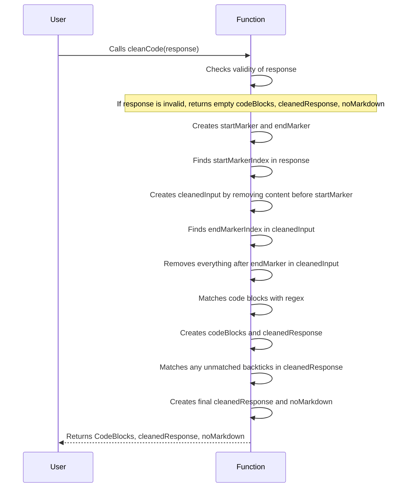

# GPTMemory Releses

All notable changes to this project will be documented in this file.
The format is based on [Keep a Changelog](https://keepachangelog.com/en/1.0.0/),
and this project adheres to [Semantic ing](https://semver.org/spec/v2.0.0.html).

Changelog maintained after version 1.3.0

##  `v2.0.1` - 2020-05-03

### Fixed
- fix `css` parameter in better-docs theme properties.
- update peerDependencies to more up to date version
- [#30] fix line links in source code view
- fix problem with the methods defined directly in the interface (related to [#39])
### Added
- add the ability to include a stylesheet via templates.default.staticFiles and then include it in the final theme via templates[better-docs].css

##  `v2.0.0` - 2020-04-29

### Changed

- totally changed the UI
- More changes accordengly..

| Item              | In Stock | Price |
| :---------------- | :------: | ----: |
| Python Hat        |   True   | 23.99 |
| SQL Hat           |   True   | 23.99 |
| Codecademy Tee    |  False   | 19.99 |
| Codecademy Hoodie |  False   | 42.99 |

##  `v1.4.13` - 2020-04-28

### Added

- [#27] - search ability

##  `v1.4.12` - 2020-04-28

### Fixed

- update peerDependencies to more up to date version

##  `v1.4.11` - 2020-04-28

### Added

- support for flow type

##  `v1.4.10` - 2020-04-28

### Fixed

- [#30] fix line links in source code view

##  `v1.4.9` - 2020-04-28

### Added

- add the ability to include a stylesheet via templates.default.staticFiles and then include it in the final theme via templates[better-docs].css

##  `v1.4.8` - 2020-04-28

### Fixed

- [#43] - fixed windows issue

## [1.4.7] - 2019-10-18

### Fixed

- fixed problem of one line comments of types and interfaces [#40]

## [1.4.6] - 2019-10-17

### Fixed

- fix problem with the methods defined directly in the interface (related to [#39])

## [1.4.5] - 2019-10-16

### Fixed

- fix problem treating not react files as react (related to [#39])

## [1.4.4] - 2019-10-16

### Fixed

- fix problem with Array defined as {attribute: type}[] [#39]

## [1.4.4] - 2019-10-11

### Added
- support for documenting class members in typescript
- current item in sidebar is selected
- hash with the link to the documentation element

## [1.4.0] - 2019-10-03

### Added
- Add typescript support

## [1.3.3] - 2019-09-25
### Fixed
- fixed vue components preview
- attempt to fix error with paths on windows

## [1.3.2] - 2019-09-25
### Added
- add the ability to document vue components with dash in a name
### Fixed
- fix @classdesc tag for components

## [1.3.1] - 2019-09-25
### Added
- add ability to document both react and vue components
- temporarily fix height issue on react components
- add typedef plugin
### Fixed
- fix warning with className