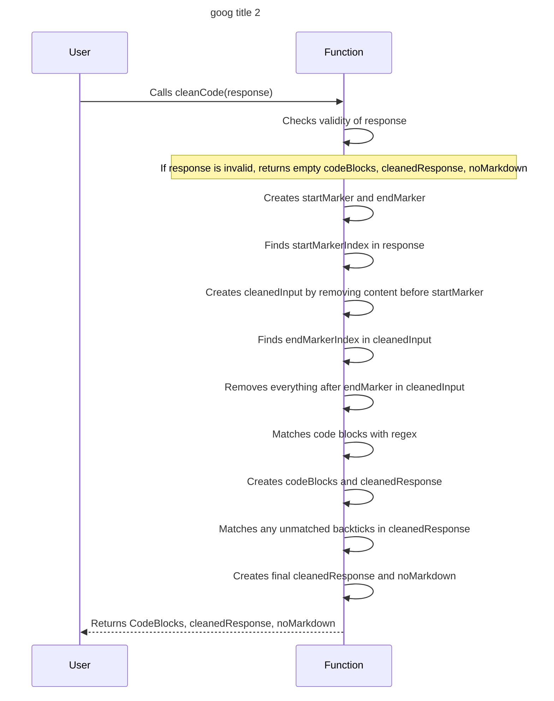

# ChatGPT Memory Extension Web App

This project aims to simulate human memory processes to provide long-term memory support for ChatGPT, particularly when dealing with complex tasks such as coding a large application.

## Description

The ChatGPT Memory Extension Web App is a web application that provides long-term memory support for ChatGPT. It uses various memory processes such as input processing, title and description extraction, hierarchical feature breakdown, recursive feature decomposition, task list generation, mind map storage, context-aware query mechanism, retrieval and updating mechanism, automatic pruning and forgetting, and integration with ChatGPT.


high-level architecture and design for the web app that simulates human memory processes to provide long-term memory support for ChatGPT.

High-Level Architecture:

1. **Frontend:**
- Use Next.js as the frontend framework for building a responsive, server-rendered React application.
- Implement Tailwind CSS for styling and creating a modern, - user-friendly interface.
- Utilize Redux RTK Query to manage the app's state and handle API calls.
2. **Backend:**
- Use Express.js to create a RESTful API server that handles user authentication, authorization, and manages all the app's features.
- Implement NextAuth.js for user authentication and authorization supporting various providers such as email, Google, or social media logins.
- Utilize PostgreSQL as the primary database to store user data, mind maps, and task lists.
- Use an Object-Relational Mapping (ORM) library like Sequelize or TypeORM to manage database operations and model relationships.
3. **Additional Components:**
 -Implement Stripe for handling any payment-related features or subscription plans.
- Use Swagger for API documentation, providing an easy-to-understand reference for developers and integrators.


## Folder structure

Below is a suggested file structure for the frontend and backend of the web app. This structure organizes the implementation phase and includes all necessary files and directories.

```tree
web-app/
│
├── frontend/ (Next.js frontend)
│   ├── components/ (React components)
│   │   ├── Auth/
│   │   │   ├── SignIn.jsx
│   │   │   └── SignUp.jsx
│   │   ├── MindMap/
│   │   │   ├── MindMap.jsx
│   │   │   ├── Node.jsx
│   │   │   └── Edge.jsx
│   │   ├── TaskList/
│   │   │   ├── TaskList.jsx
│   │   │   └── Task.jsx
│   │   └── Navigation/
│   │       ├── Header.jsx
│   │       └── Sidebar.jsx
│   ├── pages/
│   │   ├── index.jsx
│   │   ├── dashboard.jsx
│   │   ├── mindmaps/
│   │   │   ├── [id].jsx
│   │   │   └── new.jsx
│   │   └── tasks/
│   │       ├── [id].jsx
│   │       └── new.jsx
│   ├── public/
│   │   └── favicon.ico
│   ├── styles/
│   │   ├── tailwind.config.js
│   │   └── global.css
│   ├── store/
│   │   ├── store.js
│   │   ├── authSlice.js
│   │   ├── mindMapSlice.js
│   │   └── taskListSlice.js
│   └── utils/
│       └── apiClient.js
│
├── backend/ (Express.js backend)
│   ├── config/
│   │   ├── config.js
│   │   └── db.js
│   ├── controllers/
│   │   ├── authController.js
│   │   ├── mindMapController.js
│   │   └── taskListController.js
│   ├── middleware/
│   │   └── authMiddleware.js
│   ├── models/
│   │   ├── User.js
│   │   ├── MindMap.js
│   │   └── Task.js
│   ├── routes/
│   │   ├── authRoutes.js
│   │   ├── mindMapRoutes.js
│   │   └── taskListRoutes.js
│   ├── utils/
│   │   └── errorHandler.js
│   └── app.js
│
├── api-docs/ (Swagger API documentation)
│   └── swagger.json
│
├── .env
├── .gitignore
├── package.json
└── README.md
```

## Parameters

- Nextjs
- NextAuth
- Stripe
- Redux RTK Query
- Tailwind
- PostgreSQL
- Express
- Swagger

## Usage Instructions

To use this project, follow these steps:

1. Clone the repository to your local machine.
2. Install the dependencies using `npm install`.
3. Start the development server using `npm run dev`.
4. Open your browser and navigate to `http://localhost:3000`.

## Examples

Here are some examples of how to use this project:

- To authenticate a user, use the NextAuth library.
- To manage state, use the Redux RTK Query library.
- To style the UI, use the Tailwind library.
- To store data, use the PostgreSQL database.
- To document the API, use the Swagger library.

## Target Audience

This project is intended for developers who use ChatGPT and need long-term memory support for complex tasks such as coding a large application.

## chart





## License

This project is licensed under the MIT License. See the LICENSE file for details.
