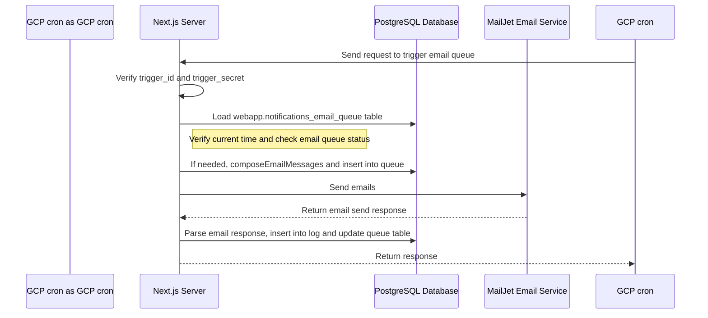
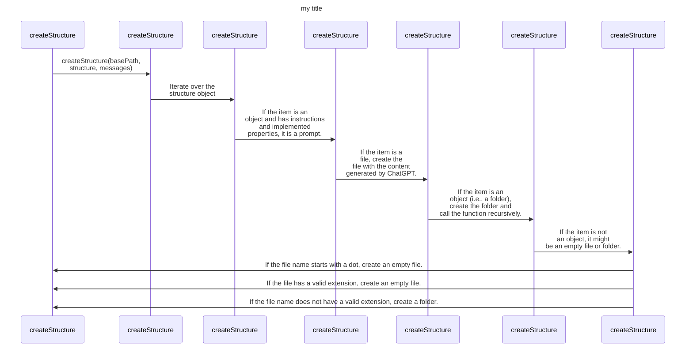

# GaiaLens Controversy Alerts

## About Gaialens

GaiaLens® provides a real-time ESG analytics platform for institutional investors who acknowledge and embrace the true power of technology to make better decisions.

A dashboard granting live access to accurate and scientifically curated ESG data on 18,000 companies, calculating comprehensive, objective and unbiased real-time scores across E, S and G pillars.


### What is Controversy alerts feature?

This feature is a part often alerting system for GaiaLens main application. It controls the sending of emails to users based on different controversies triggers and maintains an email queue.

### How it works?

The main functionality can be summarized as follows:

1. **Email Queue Management**: The script checks if there are unsent emails in the queue and whether it's the appropriate time to send them (between 9 am and 5 pm). If the queue is empty and it's within the specified time frame, new emails are composed and inserted into the queue.

2. **Email Composition**: If it's the right time and the queue is empty, the system composes new emails and adds them to the queue.

3. **Email Sending**: If the queue is filled and it's the appropriate time, emails are sent to the recipients.

4. **Logging and Updating**: Sent emails are logged for future reference, and the queue is updated to mark the sent emails.

5. **Authentication**: To trigger this process, a valid `trigger_id` and `trigger_secret` are required. These are used to authenticate the request and ensure that only a cron job (or a similar automated process) can trigger the function.

6. **Error Handling**: The script includes error handling measures. If an error occurs at any stage of the process, an error message is sent to a support email address for further investigation.

Planned features for version V1.1 include support for generic types (subscriptions_types), storing the trigger id in the queue log, adding a trigger type table to the database, and adjusting trigger times from a dashboard.



The feature  is a part of an automated email notification system. It's responsible for composing, queuing, and sending emails to users based on specific triggers. It's used in situations where applications need to notify users about controversies related to companies, and in the future will be used to updates, and send alerts regarding news, ESG information and more.

This feature is designed to function within a specific timeframe (9 am to 5 pm), manage the email queue (add new emails when the queue is empty, and send them when it's time), and handle errors that might occur in the process.

It's also designed to ensure security and integrity by requiring specific authentication (using a trigger_id and trigger_secret) to activate the email notification process. This prevents unauthorized users from triggering the email sending process.

In addition to this, the feature logs sent emails and updates the queue status. Future enhancements of this feature plan to include support for generic types, storing trigger id in the queue log, adding a trigger type table to the database, and making trigger times adjustable from a dashboard.

```mermaid
---
title: this is a title
---
flowchart TD
     A[createStructure] --> B(check if messages is array of strings and convert it to array of objects)
     B --> C(create context by new prompts to message object)
     C --> D(remove duplicate messages from _messages array)
     D --> E(Iterate over the structure object)
     E --> F(If the item is an object and has instructions and implemented properties it is a prompt)
     F --> G(If the item is a file create the file with the content generated by ChatGPT)
     G --> H(add file name to user content)
     H --> I(add dependencies to user content)
     I --> J(If the item is an object i.e. a folder create the folder and run the function recursively)
     J --> K(If the item is not an object it might be an empty file or folder)
     K --> L(If the file name starts with a dot create an empty file)
     L --> M(If the file has a valid extension create an empty file)
     M --> N(If the file name does not have a valid extension create a folder)
     N --> O(Error details: Key Item  ItemPath )
     O --> P(Error while creating )
```





```js
// returns a string
htmlPart({
    userInfo: {
        first_name: "John",
        last_name: "Doe",
        email: "",
    },
    portfoliosNames: ["UK Alpha", "UK Alpha 2"],
    portfoliosData: [
        {
            portfolio_name: "UK Alpha",
            holdings: [{ company_name: "Company 1", scandal: { title: "Scandal 1" } }],
        },
    ],
    uniqueScandalsList: [
        { title: "Scandal 1", company_name: "Company 1", publisher: "Publisher 1" },
    ],
});
```

# Example email

