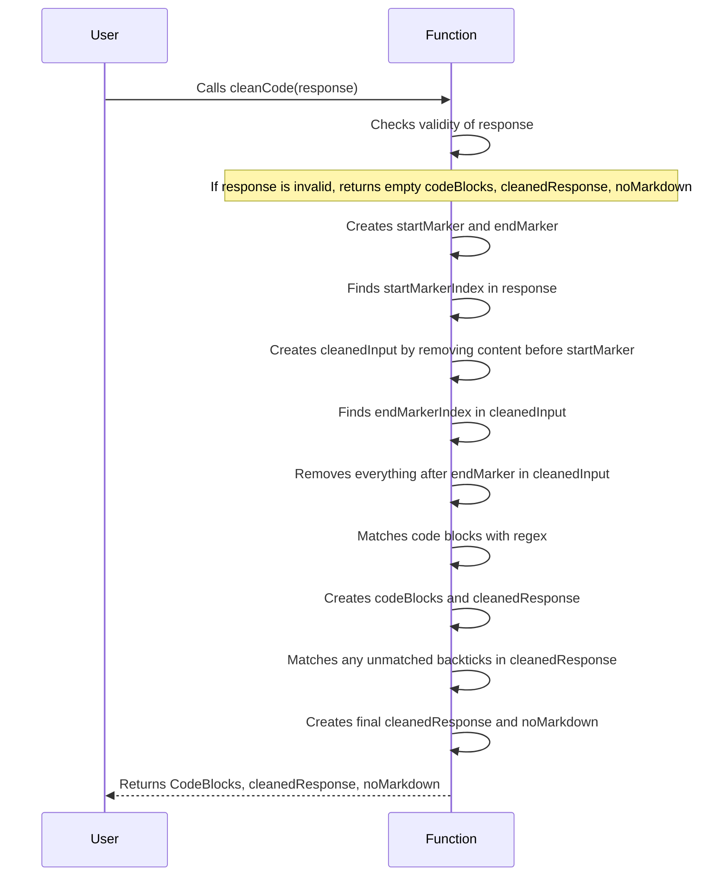

# ChatGPT Memory Extension Web App

This project aims to simulate human memory processes to provide long-term memory support for ChatGPT, particularly when dealing with complex tasks such as coding a large application.

## Description

The ChatGPT Memory Extension Web App is a web application that provides long-term memory support for ChatGPT. It uses various memory processes such as input processing, title and description extraction, hierarchical feature breakdown, recursive feature decomposition, task list generation, mind map storage, context-aware query mechanism, retrieval and updating mechanism, automatic pruning and forgetting, and integration with ChatGPT.
<div></div>
## Parameters

- Nextjs
- NextAuth
- Stripe
- Redux RTK Query
- Tailwind
- PostgreSQL
- Express
- Swagger

## Usage Instructions

To use this project, follow these steps:

1. Clone the repository to your local machine.
2. Install the dependencies using `npm install`.
3. Start the development server using `npm run dev`.
4. Open your browser and navigate to `http://localhost:3000`.

| Syntax      | Description | Test Text     |
| :---        |    :----:   |          ---: |
| Header      | Title       | Here's this   |
| Paragraph   | Text        | And more      |

| Item              | In Stock | Price |
| :---------------- | :------: | ----: |
| Python Hat        |   True   | 23.99 |
| SQL Hat           |   True   | 23.99 |
| Codecademy Tee    |  False   | 19.99 |
| Codecademy Hoodie |  False   | 42.99 |

## Examples

Here are some examples of how to use this project:

- To authenticate a user, use the NextAuth library.
- To manage state, use the Redux RTK Query library.
- To style the UI, use the Tailwind library.
- To store data, use the PostgreSQL database.
- To document the API, use the Swagger library.

```javascript
function hashToLink(doclet, hash) {
  var url

  if ( !/^(#.+)/.test(hash) ) {
    return hash
  }

  url = helper.createLink(doclet)
  url = url.replace(/(#.+|$)/, hash)

  return '<a href="' + url + '">' + hash + '</a>'
}
```

## Target Audience

This project is intended for developers who use ChatGPT and need long-term memory support for complex tasks such as coding a large application.

## chart



## License

This project is licensed under the MIT License. See the LICENSE file for details.